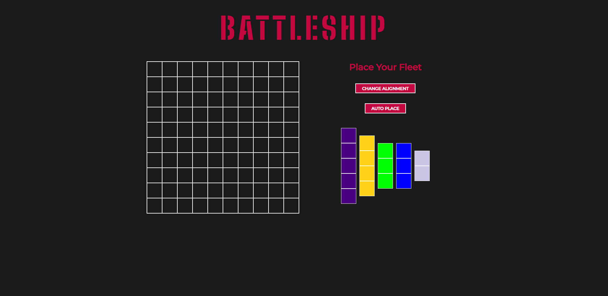
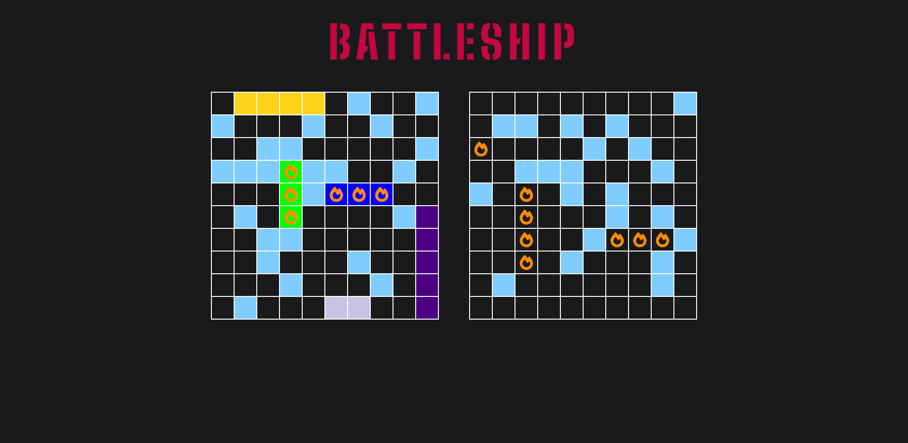
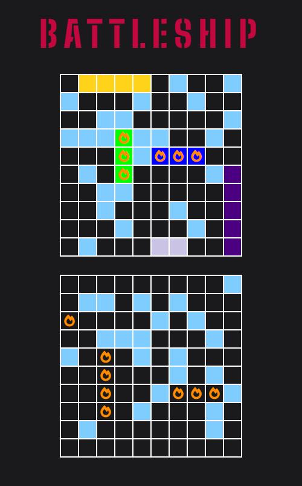

## Battleship
A battleship game where the goal is to try and sink all of the opponent's ships. 

- Live Demo: https://aidenm99.github.io/Weather-App/

## Technologies Used
This project was built using:
- HTML5
- CSS
- JavaScript
- Jest
- Sass
- Webpack

## Features
- Smart AI that makes logical moves as an actual human would (does not "cheat")
- Interactive browser-based game akin to the Hasbro™ board game
- Simple and easy-to-use UI
- Drag and drop ships onto the board or auto-place them
- Change the alignment of ships
- Playable on mobile devices, fully responsive

## Challenges
A particularly difficult challenge with this project was devising an algorithm for the AI to make logical moves and play as a human would. This took more time than I 
anticipated, however it was the most rewarding part of the project.

This project was created following test-driven development principles, which means that I wrote the code, tested the code and implemented the code only when the tests were
passed. I used the Jest framework to achieve this, which was completely new to me at the time. Because of this, the Jest syntax was challenging to learn at first. In addition, 
I also had some difficulty figuring out the how's and why's behind using Jest mocks, as they were something I needed to utilise to compensate for some of the Math.random()
functions I used throughout the code.

## Screenshots
Pre-game screen

The game

Mobile view

